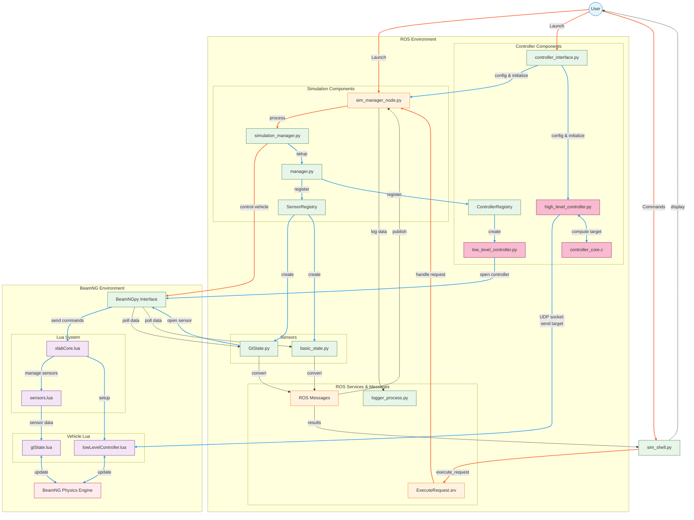

# BeamNG-ROS2 Bridge: Autonomous Vehicle Simulation Framework

A comprehensive framework connecting ROS2 with the BeamNG vehicle simulator, enabling high-fidelity physics-based simulation for autonomous driving research and development.

## Features

- **High-fidelity vehicle simulation** with BeamNG's realistic physics engine
- **Advanced sensor suite** including ground truth state, IMU, GPS, and more
- **Dual-level controller architecture** (high-level and low-level)
- **ROS2 integration** with custom messages, services, and publishers
- **YAML-based configuration** for easy scenario and vehicle setup
- **Interactive shell** for real-time simulation control
- **Data logging and replay** capabilities for experiment analysis

## System Architecture



The system consists of these key components:

| Component | Description |
|-----------|-------------|
| **SimulationManager** | Core component managing BeamNG instances, scenarios, and vehicles |
| **VehicleManager** | Handles individual vehicles and their configurations |
| **Sensors** | Various sensor types for vehicle state and environment perception |
| **Controllers** | Both low-level actuator control and high-level decision making |
| **ROS2 Interface** | Bridge between simulation and ROS2 ecosystem |

## Prerequisites

- ROS2 (Humble or newer)
- BeamNG.tech simulator
- Python 3.8+
- Operating System:
  - Windows with WSL2, or
  - Native Linux (in beta for BeamNG.tech)

## Installation

> [!NOTE]
> Step 2 assumes you have a working ROS2 environment.
> The provided flake.nix will install ROS2 and dependencies, allowing you to skip step 2.

1. **Clone the repository:**
   ```bash
   cd ~/ros2_ws/src
   git clone https://github.com/your-organization/bng_xal.git
   ```

2. **Install dependencies:**
   ```bash
   cd ~/ros2_ws
   rosdep install --from-paths src --ignore-src -r -y
   ```

3. **Build the workspace:**
   ```bash
   colcon build
   ```

4. **Source the workspace:**
   ```bash
   source install/setup.bash
   ```

## Configuration

### BeamNG Setup

1. Ensure BeamNG.tech is installed and configured according to the BeamNG documentation
2. Set up network communication:
   - For WSL2, find the correct IP address:
     ```bash
     ip route show | grep -i default | awk '{ print $3}'
     ```
   - Update the IP in your scenario configuration files

### YAML Configuration Structure

Simulation scenarios and vehicles are configured via YAML files located in the `config` directory:

```yaml
# Example configuration snippet
beamng:
  host: 172.26.32.1
  port: 64256
  
scenario:
  level: smallgrid
  name: basic

vehicles:
  ego:
    model: utv
    sensors:
      gtstate:
        type: GtState
        gfx_update_time: 0.15
        physics_update_time: 0.005
```

## Usage

### Launch Commands

1. **Start the simulator:**
   ```bash
   ros2 launch bng_simulator simulator.launch.py
   ```

2. **Launch with controller:**
   ```bash
   ros2 launch bng_controller controller.launch.py
   ```

3. **Custom configuration:**
   ```bash
   ros2 launch bng_simulator simulator.launch.py config_path:=/path/to/config.yaml
   ```

### Launch File Parameters

#### Simulator Launch Parameters

| Parameter | Default | Description |
|-----------|---------|-------------|
| `config_path` | `[pkg_share]/config/basic_scenario.yaml` | Path to the simulation configuration file |
| `log_level` | `INFO` | Logging level (DEBUG, INFO, WARNING, ERROR, CRITICAL) |

#### Controller Launch Parameters

| Parameter | Default | Description |
|-----------|---------|-------------|
| `config_path` | `[pkg_share]/config/basic_scenario.yaml` | Path to BeamNG simulation configuration file |
| `log_level` | `INFO` | Logging level (DEBUG, INFO, WARNING, ERROR, CRITICAL) |

### Interactive Shell

Access the interactive simulation shell for direct control:

```bash
ros2 run bng_simulator sim_shell
```

**Available commands:**
- `vehicles` - List available vehicles
- `teleport vehicle_name=ego pos=[0,0,0] yaw_angle=90` - Teleport a vehicle
- `control vehicle_name=ego steering=0.5 throttle=0.7 brake=0` - Send control inputs
- `logger start /path/to/logs` - Start data logging
- `exec get_vehicle_properties vehicle_name=ego` - Execute custom commands

### ROS2 Services

Interact with the simulator using ROS2 services:

```bash
# Execute a command
ros2 service call /execute_request bng_msgs/srv/ExecuteRequest "{function_name: 'teleport_vehicle', arguments: 'vehicle_name: ego\npos: [0, 0, 0]\nyaw_angle: 90'}"

# Start logging
ros2 service call /start_logger bng_msgs/srv/StartLogger "{save_location: '/tmp/logs', max_queue_size: 1000, flush_interval: 0.5}"
```

## Troubleshooting

### Common Issues

1. **BeamNG Focus Issue**  
   **Problem:** BeamNG.tech requires focus when managing scenarios  
   **Solution:** Ensure the BeamNG window is focused, not minimized

2. **IP Configuration**  
   **Problem:** Incorrect IP address prevents communication  
   **Solution:** Verify the IP in scenario config matches WSL2 IP

3. **Vehicle Control Instability**  
   **Problem:** Vehicles may behave erratically after teleportation  
   **Solution:** Reset vehicle state with `teleport vehicle_name=ego reset=true`

4. **Sensor Data Missing**  
   **Problem:** Sensors not publishing data  
   **Solution:** Check sensor configuration and poll rates

## License

This project is licensed under the MIT License - see the LICENSE file for details.

## Acknowledgments

- BeamNG.tech team for providing the simulation environment
- ROS2 community for the robotics framework
- All contributors to this project

## Further Documentation

For detailed documentation, API references, and examples, please visit:
[https://your-organization.github.io/bng_xal/](https://your-organization.github.io/bng_xal/)
