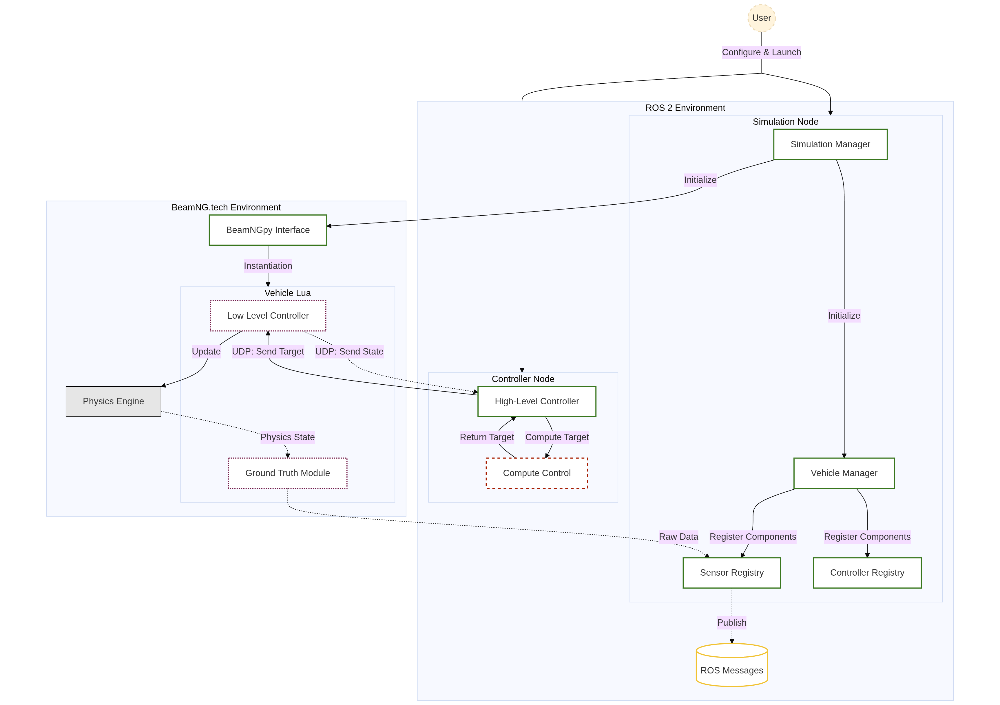

# BeamNG-ROS2 Bridge: Autonomous Vehicle Simulation Framework

A comprehensive framework connecting ROS2 with the BeamNG vehicle simulator, enabling high-fidelity physics-based simulation for autonomous driving research and development.

## Features

- **High-fidelity vehicle simulation** with BeamNG's realistic physics engine
- **Advanced sensor suite** including ground truth state, IMU, GPS, and more
- **Dual-level controller architecture** (high-level and low-level)
- **ROS2 integration** with custom messages, services, and publishers
- **YAML-based configuration** for easy scenario and vehicle setup
- **Interactive shell** for real-time simulation control
- **Data logging and replay** capabilities for experiment analysis

## System Architecture



The system consists of these key components:

| Component | Description |
|-----------|-------------|
| **SimulationManager** | Core component managing BeamNG instances, scenarios, and vehicles. Part of `bng_simulator`. |
| **VehicleManager** | Handles individual vehicles and their configurations. Part of `bng_simulator`. |
| **Sensors** | Various sensor types for vehicle state and environment perception. Configured in `bng_simulator`, data often published via `bng_msgs`. |
| **Controllers** | Both low-level actuator control (via `luamod`) and high-level decision making (e.g., `bng_controller`). |
| **ROS2 Interface** | Bridge between simulation and ROS2 ecosystem, primarily managed by `bng_simulator` using `bng_msgs`. |

## Package Overview

This framework is organized into several key modules:

*   **`luamod/`**: Contains low-level Lua modifications for the BeamNG.tech simulator. These mods are essential for enabling custom interactions, sensor data extraction, and advanced vehicle control capabilities directly within the simulation environment.
    *   [Details in `luamod/README.md`](luamod/README.md)
*   **`bng_simulator`**: The core ROS 2 package responsible for launching, managing, and interacting with BeamNG.tech simulation instances. It handles scenario definitions, vehicle spawning, and the primary bridge to ROS 2.
    *   [Details in `src/bng_xal/bng_simulator/README.md`](src/bng_xal/bng_simulator/README.md)
*   **`bng_msgs`**: This ROS 2 package defines the custom messages and services necessary for communication between various ROS 2 nodes and the BeamNG.tech simulation. It provides the data structures for exchanging information like vehicle state, sensor readings, and control commands.
    *   [Details in `src/bng_xal/bng_msgs/README.md`](src/bng_xal/bng_msgs/README.md)
*   **`bng_controller`**: A ROS 2 package that provides high-level control algorithms for vehicles within the BeamNG.tech simulation. It typically subscribes to vehicle state and sensor information (via `bng_msgs`) and publishes control commands.
    *   [Details in `src/bng_xal/bng_controller/README.md`](src/bng_xal/bng_controller/README.md)

## Prerequisites

Without Nix:
- ROS2 (Humble or newer)
- BeamNG.tech simulator
- Python 3.8+
- Operating System:
  - Windows with WSL2, or
  - Ubuntu 24.04 LTS (beta support for BeamNG.tech)

With Nix:
- Working Nix installation
- Flakes enabled

## Installation

> [!NOTE]
> Step 2 assumes you have a working ROS2 environment.
> The provided flake.nix will install ROS2 and dependencies, allowing you to skip step 2.
> Simply run `nix develop` to install the ROS2 environment and all dependencies.

1. **Clone the repository:**
   ```bash
   cd ~/ros2_ws/src
   git clone https://github.com/xal-rpi/sim_ros_framework
   ```

2. **Install dependencies:**
   ```bash
   cd ~/ros2_ws
   rosdep install --from-paths src --ignore-src -r -y
   ```

3. **Build the workspace:**
   ```bash
   colcon build
   ```
> [!NOTE]
> Remember that building is needed after all file changes, even configuration files, unless you specify `--symlink-install`.

4. **Source the workspace:**
   ```bash
   source install/setup.bash
   ```

## Configuration

### BeamNG Setup

1. Ensure BeamNG.tech is installed and configured according to the BeamNG documentation
2. Set up network communication:
   - For WSL2, find the correct IP address and update the IP in your scenario configuration files:
     ```bash
     ip route show | grep -i default | awk '{ print $3}'
     ```
     or [set networkingMode=mirrored under \[wsl2\] in the .wslconfig file](https://learn.microsoft.com/en-us/windows/wsl/wsl-config#configuration-settings-for-wslconfig) and use the default configuration.
   - On linux using the default `127.0.0.1` config should work.

### YAML Configuration Structure

Simulation scenarios, vehicle properties, sensor details, and controller parameters are primarily configured via YAML files. The main configuration files are typically processed by the `bng_simulator` and `bng_controller` packages.

For a detailed explanation of the YAML structure for scenarios, vehicles, and sensors, please refer to the [bng_simulator README](src/bng_xal/bng_simulator/README.md#configuration-config-directory).
For details on configuring the high-level controller, see the [bng_controller README](src/bng_xal/bng_controller/README.md).

A brief example of a configuration snippet:
```yaml
# Example: Part of a scenario configuration (typically in bng_simulator/config/scenarios/)
beamng:
  host: 127.0.0.1 # Default for local Linux, adjust for WSL2 if needed
  port: 64256

scenario:
  level: smallgrid # BeamNG level to load
  name: basic_example

vehicles:
  ego: # Vehicle name
    model: utv # BeamNG vehicle model
    sensors:
      gtstate: { type: GtState, gfx_update_time: 0.1, physics_update_time: 0.01 }
    controllers:
      LowLevelController: { type: default, control_rate: 0.1 } # Refers to luamod controller

# Example: Part of a high-level controller configuration (used by bng_controller)
high_level_controller:
  control_fn: PY_compute_control_follow
  path_file: loop.csv
```
The mapping from YAML configurations to specific code components (like `SimulationManager` or Lua controllers) is detailed within the respective package READMEs, particularly `bng_simulator`.

## Usage

### Launch Commands

1. Start BeamNG: `./BinLinux/BeamNG.tech.x64 -tcom -colorStdOutLog [-disable-sandbox] [-nosteam]`
> [!NOTE]
> Disable the sandbox when using a controller that calls `ffi.load()` (e.g., those starting with `nn` in `luamod`).
> Adding `-nosteam` prevents some errors showing up in the lua console but is not required.
2. **Start the relevant ROS nodes**:
   - Only the sensors:
   ```bash
   ros2 launch bng_simulator simulator.launch.py
   ```
   - Sensors and controllers:
   ```bash
   ros2 launch bng_controller controller.launch.py
   ```

For detailed launch parameters accepted by `simulator.launch.py` and `controller.launch.py`, please refer to the README files of the `bng_simulator` and `bng_controller` packages, respectively.
*   [bng_simulator Launch Arguments](src/bng_xal/bng_simulator/README.md#launching-the-simulator)
*   [bng_controller Launch Arguments](src/bng_xal/bng_controller/README.md#launching-the-controller)

### Available utility scripts

Several utility scripts are provided across the packages:

#### `sim_shell` (from `bng_simulator`)

This interactive shell allows for real-time control and inspection of the simulation.
```bash
ros2 run bng_simulator sim_shell
```
Once inside, type `help` to see available commands. For more details, see the [bng_simulator README](src/bng_xal/bng_simulator/README.md#important-scripts-bng_simulatorscripts).

#### `start_logs` (from `bng_simulator`)
Writes GtState sensor data to disk as a pickle file.
```bash
ros2 run bng_simulator start_logs [--max_queue_size N] [--flush_interval T]
```
For details on arguments, see the [bng_simulator README](src/bng_xal/bng_simulator/README.md#important-scripts-bng_simulatorscripts).

#### `find_ema` (from `bng_simulator`)
A utility to help tune Exponential Moving Average (EMA) parameters used in `gtstate.lua` (part of `luamod`).
```bash
ros2 run bng_simulator find_ema [OPTIONS]
```
For details on arguments, see the [bng_simulator README](src/bng_xal/bng_simulator/README.md#important-scripts-bng_simulatorscripts).

#### `generate_path` (from `bng_controller`)
Creates a CSV file describing random paths for the high-level controller.
```bash
ros2 run bng_controller generate_path [OPTIONS]
```
For details on arguments, see the [bng_controller README](src/bng_xal/bng_controller/README.md#path-generation-scripts).

#### `send_override_target` (from `bng_controller`)
Override the targets sent by the compute_control function of the HLC.
```bash
ros2 run bng_controller send_override_target [OPTIONS]
```
For details on arguments, see the [bng_controller README](src/bng_xal/bng_controller/README.md#target_override_script).

### ROS2 Services

Interact with the simulator and other components using ROS2 services. Service definitions are provided by the `bng_msgs` package.

Example:
```bash
# Request vehicle teleportation (handled by bng_simulator)
ros2 service call /execute_request bng_msgs/srv/ExecuteRequest "{function_name: 'teleport_vehicle', arguments: 'vehicle_name: ego\npos: [0, 0, 0]\nyaw_angle: 90'}"

# Start data logging (handled by bng_simulator)
ros2 service call /start_logger bng_msgs/srv/StartLogger "{save_location: '/tmp/logs', max_queue_size: 1000, flush_interval: 0.5}"
```
For a list of available services and their definitions, refer to the [bng_msgs README](src/bng_xal/bng_msgs/README.md#services) and the READMEs of the packages that provide them (mainly `bng_simulator`).

## Troubleshooting

### Common Issues

1. **BeamNG Focus Issue**
   - **Problem:** BeamNG.tech requires focus when managing scenarios
   - **Solution:** Ensure the BeamNG window is focused, not minimized

2. **IP Configuration**
   - **Problem:** Incorrect IP address prevents communication
   - **Solution:** Verify the IP in scenario config matches WSL2 IP

3. **Vehicle Control Instability**
   - **Problem:** Vehicles may behave erratically after teleportation
   - **Solution:** Reset vehicle state with `teleport vehicle_name=ego reset=true`

4. **Sensor Data Missing**
   - **Problem:** Sensors not publishing data
   - **Solution:** Check sensor configuration and poll rates

5. **Request not handled by BNG:**
   - **Problem:** The controller crashes with `The request was not handled by BeamNG.tech` error after having hot reloaded the mod
   - **Solution:** Restart BNG, wait at least one second before starting the ROS nodes

6. **Torque target not applied properly:**
   - **Problem:** The reported torque is different from the target torque
   - **Solution:** Ensure units are metric in the GUI settings of BNG

## Acknowledgments

- BeamNG.tech team for providing the simulation environment and help on the forums
- ROS2 community for the robotics framework
- @neverless for their help on the lua side
- All contributors to this project
