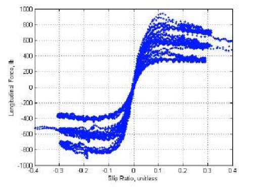

# Lab 3 — Longitudinal Slip and Longitidunal Tire Force from Data

**Theme:** torque → wheel dynamics → slip → longitudinal force → motion

In this lab you will (i) generate a repeatable straight-line longitudinal experiment by commanding drive torque over time, (ii) log vehicle + wheel signals, (iii) compute slip ratio, and (iv) estimate front/rear longitudinal tire forces using a simple inverse-dynamics problem that uses three measured state derivatives.

You will run the same experiment twice: once on a nominal surface and once on a low-friction surface. Your write-up is short: clear plots and a qualitative interpretation.

---

## Pre-lab: setup + pipeline sanity check

Before implementing the main experiment, make sure your pipeline works end-to-end.

### (a) Update + build the ROS2 workspace (WSL)

In WSL, update the repo and rebuild the workspace overlay. From a terminal:

```bash
cd ~/ros2_ws/src/sim_ros_framework
git pull origin hpa-s26

# Rebuild (recommended to start this lab from a clean build)
./xal_bng_ws_build.bash -w ~/ros2_ws -r jazzy --clean

# Just this tim. Any newly opened terminal will source automatically from .bashrc
source ~/ros2_ws/install/setup.bash
```

Notes:
- The build helper supports `--clean` (wipe `build/ install/ log/`) and `--clean-pkg <name>` (wipe just one package).
- You should not need to install new dependencies for this pre-lab if your environment is already set up for the course.

### (b) Start BeamNG on Windows (PowerShell)

Start BeamNG.tech / BeamNG.drive on **Windows** following the “Telemetry tutorial” procedure from last week. **Make sure you are using the correct IP address**.

### (c) Connect to BeamNG from WSL + verify data in PlotJuggler

In a WSL terminal (with the workspace sourced):

```bash
ros2 launch bng_bringup basic.launch.py host:=YOUR_IP
```

In another WSL terminal, open PlotJuggler and confirm you see live topics:

```bash
ros2 run plotjuggler plotjuggler
```
You should be able to check some of the standard vehicle signals.

### (d) Record a 15–20 s “smoke test” run (interactive logger)

You will start the interactive logger and drive around in BeamNG for ~15–20 seconds (do whatever you want). To start the logger, in a WSL terminal (perhaps the same one as plotjuggler if you don't need it any more):

```bash
ros2 run bng_simulator start_logs
```

What to expect:
- The script will ask a few questions in the terminal (confirm the run, optional metadata, etc.).
- When you are done driving, type `stop` when prompted.
- The logger creates a new numbered run folder under `~/beamng_log_data/`.

After logging, you should see a structure like:

```text
~/beamng_log_data/
   run_001/ --> This will update automatically for each new run
      metadata.yaml
      data/
         data.pkl
      rosbag_YYYYMMDD_HHMMSS/
         metadata.yaml
         *.mcap
```

### (e) Load + plot in a Jupyter notebook (VS Code)

Create your analysis notebook **outside** this repository (in a folder you control for the class). Example:

```bash
mkdir -p ~/week3_analysis
cd ~/week3_analysis
code .
```

Then either:
- create a new notebook in VS Code (Python kernel), or
- open the provided sample notebook and follow/modify it:
   - [labs/week3/prelab_load_and_plot.ipynb](labs/week3/prelab_load_and_plot.ipynb)

**Pre-lab deliverable:** load one run and produce at least one clean plot of $v_x(t)$, wheel linear speeds ($w_f(t)$ and $w_r(t)$ obtained by averaging left/right `wheelXX_speed`), and `rear_wheel_torque_est(t)` vs time from `/EGO/gtstate`. Save the plots (PNG) and include them in your report.

---


### Part A — Implement the experiment (straight line, torque schedule)

You will implement a straight-line scenario:
- steering command stays at **0** throughout
- no braking
- total duration: **35 - 50s**
- log rate: **≥ 20 Hz** (50 Hz preferred)

#### Choose the surface (two provided launch configs)

This repo includes two Week 3 scenario configs that differ only by:
- the **level** (surface), and
- the vehicle **initial pose**.

From WSL (workspace sourced), launch **one of**:

```bash
ros2 launch bng_bringup basic.launch.py config:=week3_high_mu.yaml host:=YOUR_IP
ros2 launch bng_bringup basic.launch.py config:=week3_low_mu.yaml host:=YOUR_IP
```

#### Implement your torque schedule controller (student code)

You will write a small Python script or notebook cell that sends torque commands at a fixed rate (e.g. **20 Hz**) using `TorqueSpeedController`.

Guidance (skeleton — fill in the TODOs):

```python
import time
import rclpy
from bng_controller.torque_speed_controller import TorqueSpeedController

HZ = 20.0
DT = 1.0 / HZ
T_END = 38.0 # Whatever you choose

def torque_profile(t: float) -> float:
   """Return desired drive torque in N·m for elapsed time t (s)."""
   # TODO: implement the piecewise schedule table from the lab handout
   return 0.0

rclpy.init()
ctl = TorqueSpeedController(vehicle_name="EGO", spin_in_thread=True)

t0 = time.time()
next_tick = t0
try:
   while True:
      now = time.time()
      t = now - t0
      if t >= T_END:
         break

      T = torque_profile(t)
      ctl.command_torque(T, steering=0.0, brake=0.0)

      next_tick += DT
      time.sleep(max(0.0, next_tick - time.time()))
finally:
   # Safety stop
   ctl.command_torque(0.0, steering=0.0, brake=1.0)
   ctl.stop_spin()
   ctl.close()
   rclpy.shutdown()
```

#### Verify the schedule in PlotJuggler (before you log)

Before recording a run, open PlotJuggler and confirm that your command is doing what you think.

At minimum, plot:
- `/EGO/llc_cmd/torque` (commanded torque target from your script)
- `/EGO/reduced_state/wr` and `/EGO/reduced_state/vx` (rear wheel **linear** speed + vehicle speed response)

Only when these plots look correct should you start the logger.

#### Names + where to look (keep this straight)

- **Vehicle name is `EGO`**. That string appears in topic names and in the log keys.
- For **offline analysis**, you should mainly use **ground-truth**: `/EGO/gtstate` (many raw fields).
- In most runs, `/EGO/gtstate` is also the **highest-rate** and most detailed source; `/EGO/reduced_state` is smaller and already processed.
- For **live monitoring** (PlotJuggler) and quick sanity checks, `/EGO/reduced_state` is convenient because it already includes processed/lumped quantities.
- For checking your **command profile live**, use `/EGO/llc_cmd/*`.
 - Torque estimate is `rear_wheel_torque_est` (available in `/EGO/gtstate` and `/EGO/reduced_state`).

Quick unit reminders (important for Part C):
- In `/EGO/gtstate`, `wheelXX_speed` is **wheel linear (circumferential) speed** in **m/s** (not angular). We denote these as $w_f$ (front) and $w_r$ (rear).
- In `/EGO/reduced_state`, `wf` and `wr` are **left/right averaged wheel linear speeds** in **m/s** (same "type" as `wheelXX_speed`).


#### Torque schedule

Command a **piecewise-constant drive torque** profile (plateaus). Keep the *structure* below. If the vehicle is too weak/strong, you may scale all nonzero torques by a constant factor (e.g., ×0.8 or ×1.2). Note the scaling factor in your report. This is an example of profile and you can adjust the values if needed to get a good response.

Time (s) | Torque (N·m)
---|---
0–3 | 0
3–8 | +250
8–13 | +500
13–18 | +250
18–22 | 0
22–26 | +900
26–30 | +1200
30–34 | −300
34–38 | 0

You will run this schedule twice:
- **Run 1: week3_high_mu.yaml**
- **Run 2 week3_low_mu.yaml**
Make sure you remember the run numbers (e.g., `run_003`, `run_004`). It's better to add comment at the end of the logging to make sure you have metadata to identify the runs later.

---

### Signals to log

At minimum, your log must contain time-synchronized samples of:

- time `t` [s]
- vehicle velocities $v_x(t)$ [m/s] *(from `/EGO/gtstate`: `vel_x`, `vel_y`; from `/EGO/reduced_state`: `vx`, `vy`)*
- yaw rate $r(t)$ [rad/s] *(from `/EGO/gtstate`: `ang_vel_z`; from `/EGO/reduced_state`: `r`)*
- wheel **linear** wheel speeds $w_f(t), w_r(t)$ [m/s] *(from `/EGO/gtstate`: average left/right `wheelXX_speed`)*
- Estimated drive torque `T_drive(t)` [N·m] *(as sent by your controller script; see `/EGO/gtstate/rear_wheel_torque_est`)*
- Commanded torque (from `/EGO/llc_cmd/torque`)

Constants you will need (from config/docs):
- vehicle mass `m` [kg]
- wheel radius `R` [m]
- wheel inertias `I_f`, `I_r` [kg·m²]

---

## Part B — First look at the data (sanity plots)

Start with the **nominal** run.

Make plots that answer:
- Did torque follow the schedule?
- Did the vehicle speed respond sensibly?
- Do wheel speeds look reasonable?

Suggested plots:
- `T_drive(t)` and `vx(t)` on the same time axis
- `ω_f(t)` and `ω_r(t)` over time

Repeat the same quick look for the low-friction run.

*(Tip: include the torque plot early — it saves a lot of debugging.)*

---

## Part C — Slip ratio κ (proper denominator + low-speed handling)

**Due today:** Everything up until Part C should be completed and uploaded by the end of class.

Define slip ratio (front and rear):


$$
\kappa_f(t)=\frac{w_f(t)-v_x(t)}{\max(|v_x(t)|,\epsilon)},\qquad
\kappa_r(t)=\frac{w_r(t)-v_x(t)}{\max(|v_x(t)|,\epsilon)}
$$


Choose `ε` small and state your value.

In addition, for scatter plots later, you will usually want to ignore very low-speed samples
(e.g., analyze only points where `vx > 5 m/s`). This avoids low-speed division artifacts dominating the plots.

Make plots that help you interpret slip:
- overlay $v_x(t)$ and $w_r(t)$ (rear wheel linear speed) for the nominal run
- `κ_r(t)` over time (and optionally `κ_f(t)`)

**Due next Tuesday:** Parts D–F.

Repeat the slip plots for the low-friction run and compare qualitatively.

---

## Part D — Computing Derivatives from Noisy Data

### Why we need derivatives

The inverse dynamics approach requires us to compute accelerations from measured velocities:
- $\dot{v}_x$ : vehicle longitudinal acceleration
- $\dot{\omega}_f$ : front wheel angular acceleration  
- $\dot{\omega}_r$ : rear wheel angular acceleration

These accelerations tell us about the forces and torques acting on the vehicle and wheels.

### The challenge: noise amplification

Raw numerical differentiation amplifies measurement noise dramatically. If you compute:

$$\dot{x}(t_k) \approx \frac{x(t_{k+1}) - x(t_k)}{\Delta t}$$

even small noise in $x$ becomes large noise in $\dot{x}$ (especially at high sample rates where $\Delta t$ is small).

### Solution: smooth before differentiating

You must apply smoothing. Common approaches:
1. **Moving average** then differentiate (simple, effective)
2. **Savitzky–Golay filter** (fits local polynomial, differentiates analytically)
3. **Low-pass filter** (Butterworth, etc.) then differentiate

Choose a window size / cutoff frequency that removes high-frequency noise while preserving the true dynamics (torque steps, acceleration events).

### What to do

Compute smoothed derivatives:
- $\dot{v}_x(t)$ from measured $v_x(t)$
- $\dot{\omega}_f(t)$ from measured $\omega_f(t) = w_f(t)/R$
- $\dot{\omega}_r(t)$ from measured $\omega_r(t) = w_r(t)/R$

**Document your method:** state your filter type and parameters (e.g., "21-point Savitzky–Golay, 3rd order" or "50-point moving average").

**Diagnostic plots:**
- Plot $\dot{v}_x(t)$ vs time (should show smooth response to torque steps)
- Plot $\dot{\omega}_f(t)$ and $\dot{\omega}_r(t)$ vs time

---

## Part E — Estimating Tire Forces via Inverse Dynamics

### The physical model

We model the vehicle and wheels in pure longitudinal motion (no lateral dynamics, no steering, no braking).

$$m \dot{v}_x = F_{x,f} + F_{x,r}$$
$$I_f \dot{\omega}_f = -R F_{x,f}$$
$$I_r \dot{\omega}_r = T_{\mathrm{drive}} - R F_{x,r}$$

The **unknowns** are the longitudinal tire forces at the contact patches:

- $F_{x,f}$ : front axle longitudinal force (sum of left + right front tires)
- $F_{x,r}$ : rear axle longitudinal force (sum of left + right rear tires)

These forces arise from tire–road interaction and depend on slip ratio $\kappa$.

$$
\kappa_f(t)=\frac{w_f(t)-v_x(t)}{\max(|v_x(t)|,\epsilon)},\qquad
\kappa_r(t)=\frac{w_r(t)-v_x(t)}{\max(|v_x(t)|,\epsilon)}
$$

### Tire force as a function of slip ratio

Before solving for the forces, it's important to understand **how** tire longitudinal force $F_x$ depends on slip ratio $\kappa$.

**Qualitative behavior:**

1. **Small slip (near $\kappa \approx 0$):** The tire force is approximately **linear** in slip: $F_x \approx C_{\kappa} \kappa$, where $C_{\kappa}$ is the longitudinal slip stiffness. This is the regime of good traction with minimal wheel slip.

2. **Moderate slip:** As $|\kappa|$ increases, the force grows but at a decreasing rate (sublinear). The tire begins to slide more at the contact patch.

3. **Large slip (saturation):** Eventually the force reaches a **peak** (maximum traction) and may even decline slightly beyond that point. Further increases in slip produce less force — this is the "sliding" or "spinning" regime where the tire has broken loose.

4. **Surface dependence:** The peak force and the slope near zero depend strongly on the friction coefficient $\mu$ between the tire and road surface:
   - **High-μ surface** (dry asphalt): steep initial slope, high peak force, saturation at larger $|\kappa|$
   - **Low-μ surface** (ice, wet): shallow slope, low peak force, saturation at smaller $|\kappa|$



**Why this matters:** In this lab, you will estimate $F_{x,r}(\kappa_r)$ experimentally. The resulting scatter plot should reveal this characteristic nonlinear curve, and the differences between high-μ and low-μ surfaces should be clearly visible.

### Forming the least-squares problem

We have **3 equations** but only **2 unknowns** ($F_{x,f}$, $F_{x,r}$). This overdetermined system can be written as:

**Equation 1 (vehicle longitudinal dynamics):**  
$m\dot{v}_x = F_{x,f} + F_{x,r}$

**Equation 2 (front wheel dynamics):**  
$-I_f\dot{\omega}_f = R F_{x,f}$

**Equation 3 (rear wheel dynamics):**  
$T_{drive} - I_r\dot{\omega}_r = R F_{x,r}$

In matrix form: $b = A x$ where:

$$
b = \begin{bmatrix}
m\dot{v}_x \\
-I_f\dot{\omega}_f \\
T_{drive} - I_r\dot{\omega}_r
\end{bmatrix},
\quad
A = \begin{bmatrix}
1 & 1\\
R & 0\\
0 & R
\end{bmatrix},
\quad
x = \begin{bmatrix}
F_{x,f}\\
F_{x,r}
\end{bmatrix}
$$

### Solving for tire forces

At each time sample $t$, solve the least-squares problem:

$$\hat{x}(t) = (A^T A)^{-1} A^T b(t) = A^\dagger b(t)$$

where $A^\dagger$ is the Moore–Penrose pseudoinverse.

In Python (using NumPy), a pseudo code could look like:
```python
A = np.array([[1, 1],
              [R, 0],
              [0, R]])
              
for i in range(len(t)):
    b = np.array([m * dvx_dt[i],
                  -I_f * domega_f_dt[i],
                  T_drive[i] - I_r * domega_r_dt[i]])
    
    F_hat = np.linalg.lstsq(A, b, rcond=None)[0]
    F_xf[i] = F_hat[0]
    F_xr[i] = F_hat[1]
```

### Sanity check: force balance

The first equation says $m \dot{v}_x = F_{x,f} + F_{x,r}$. After solving, plot:
- $m \dot{v}_x(t)$ (left-hand side)
- $\hat{F}_{x,f}(t) + \hat{F}_{x,r}(t)$ (right-hand side from your estimates)

They should track each other closely (though not perfectly due to model simplifications and noise).

### What you need from config

- Vehicle mass: $m$ [kg]
- Wheel radius: $R$ [m]  
- Wheel inertias: $I_f$, $I_r$ [kg·m²] (front and rear axle lumped inertias)

---

## Part F — Tire Force vs Slip: The Main Result

### Objective

You now have two time series for each run (nominal and low-friction):
1. Slip ratio: $\kappa_r(t)$
2. Estimated rear tire force: $\hat{F}_{x,r}(t)$

The goal is to visualize the relationship $\hat{F}_{x,r}(\kappa_r)$ — this is the **tire characteristic curve**.

### Create a scatter plot

For each dataset (nominal and low-friction), plot:
- **x-axis:** $\kappa_r(t)$  
- **y-axis:** $\hat{F}_{x,r}(t)$

Each point represents one time sample. Do **not** connect the points — this is a scatter, not a time series.

**Filtering:** To avoid low-speed artifacts, only include samples where $v_x > 5$ m/s.

### Expected behavior

**Nominal (high-μ) surface:**
- Near $\kappa_r \approx 0$: approximately linear ($F_{x,r} \approx C \kappa_r$ where $C$ is the cornering stiffness analog for longitudinal slip)
- As $|\kappa_r|$ increases: force grows sublinearly and eventually saturates (peak force, then possibly declining)
- Peak force is relatively high

**Low-friction (low-μ) surface:**
- Smaller slope near $\kappa_r \approx 0$ (lower stiffness)
- Saturation occurs at lower $|\kappa_r|$ and lower peak force
- Overall, forces are much smaller

**Overlay the two:** plotting both on the same axes clearly shows the effect of surface friction on tire force generation.

### Physical interpretation

- The **linear region** near zero slip is where the tire generates force efficiently (small slip, good traction).
- **Saturation** occurs when the tire begins to slide significantly — more slip doesn't produce proportionally more force.
- **Peak force** is determined by the friction coefficient $\mu$ and normal load.
- On low-μ surfaces, peak force is reduced and saturation happens sooner (tire "breaks loose" more easily).

### What to include in your report

**Plot:**  
Scatter plot of $\hat{F}_{x,r}$ vs $\kappa_r$ with both nominal and low-friction runs overlaid (use different colors/markers).

**Short qualitative analysis (3–4 sentences):**
1. At what slip ratio does the rear tire force peak in the nominal case?
2. How does the low-friction curve differ (slope, peak force, slip at peak)?
3. What does this tell you about driving on slippery surfaces? (Hint: more throttle → more slip → not necessarily more force.)

1. In the nominal run, when does rear slip start to appear (based on `κ_r(t)`)?
2. Compare nominal vs low-μ: how does the rear force–slip curve change (slope near zero, saturation level, onset of large κ)?
3. List two limitations of the inverse dynamics estimate you computed (examples: derivative noise, neglected resistive forces, torque meaning, model assumptions).

---