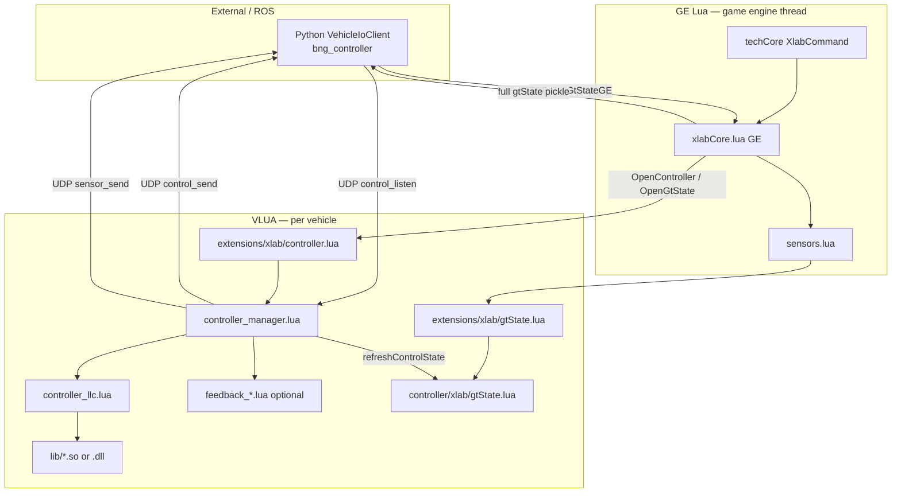

# XLab Lua mod (`luamod`)

BeamNG extension that bridges external control (ROS / Python) to in-sim vehicle physics:
UDP commands in, live `control_state` and sensor observations out, low-level actuation on the
vehicle Lua (vlua) thread.

The ROS side lives under `src/bng_xal/`; this directory is the **in-game mod** packaged as
`xlab.zip`.

---

## Quick start (first run)

### 1. Prerequisites

| Tool | Purpose |
|------|---------|
| BeamNG.drive / BeamNG.tech | Target simulator |
| Git | `build.bash` uses `git ls-files` in default mode |
| C compiler | Compile torque map `.so` / `.dll` from `lib/policies/*.c` |
| `zip` | Package the mod |
| Bash | Run `build.bash` (native Linux, WSL, or Git Bash) |

**Windows game + WSL build:** install `x86_64-w64-mingw32-gcc` when cross-compiling torque map
libs for the Windows BeamNG process (`--platform=windows`).

**Native torque map libs:** BeamNG must run with Lua sandbox disabled:
`-disable-sandbox` (required for `ffi.load` on `.so` / `.dll`).

### 2. Find your mods directory

The install path depends on **product**, **version**, and **OS**. The build script default
(`~/.local/share/BeamNG.drive/0.35/mods`) is only a fallback — set `BEAMNG_MOD_DIR` to the
folder that actually exists on your machine.

**Linux (native game)**

```text
~/.local/share/BeamNG.drive/<version>/mods/
~/.local/share/BeamNG/BeamNG.tech/<version>/mods/
```

`<version>` is whatever BeamNG created (e.g. `0.35`, `0.38`). If unsure, launch the game once
and look under `~/.local/share/BeamNG*` for a `mods` folder.

**WSL → Windows BeamNG**

Mount the Windows user folder and point at the game's `mods` directory:

```bash
# BeamNG.drive (consumer)
export BEAMNG_MOD_DIR="/mnt/c/Users/<you>/AppData/Local/BeamNG.drive/0.35/mods"

# BeamNG.tech (research build) — path often uses current/ instead of a fixed 0.xx
export BEAMNG_MOD_DIR="/mnt/c/Users/<you>/AppData/Local/BeamNG/BeamNG.tech/current/mods"
```

Persist in `~/.bashrc` if you build often.

### 3. Build and install

From the repo:

```bash
cd /path/to/sim_ros_framework/luamod
chmod +x build.bash

# Linux-native game (default)
./build.bash

# WSL host building for Windows BeamNG
./build.bash --platform=windows

# Include every Lua/JSON source on disk, not only git-tracked files
./build.bash --lua=all
```

**Build options**

| Flag | Default | Meaning |
|------|---------|---------|
| `--platform=linux` | yes | Compile `.so`, zip for Linux BeamNG |
| `--platform=windows` / `--win` | | Cross-compile `.dll` with MinGW |
| `--lua=tracked` | yes | Package only **git-tracked** `*.lua` and `lua/**/*.json` |
| `--lua=all` / `--all` | | Package **all** `*.lua` / `*.json` under `luamod/` |

Tracked mode keeps the zip reproducible from a clean checkout. Use `--lua=all` only when
you intentionally want untracked WIP sources in the package.

The script also compiles each `lib/policies/<stem>.c` → `lib/<stem>.{so,dll}`.

Output: `xlab.zip` written directly to `$BEAMNG_MOD_DIR` (or the script default).

### 4. Verify installation

1. Confirm `xlab.zip` exists in your mods folder.
2. Launch BeamNG → **Mod manager** → enable **xlab** (restart / reload Lua if prompted).
3. Start a scenario that loads the GE extension, e.g. `gridworld.yaml` sets
   `extensions: [xlab/xlabCore]`.
4. In the log you should see controller I/O bind lines from `ControllerManager` when a vehicle
   controller opens.

Optional symlink for convenience:

```bash
ln -sf "$(pwd)/build.bash" ~/.local/bin/xlab-build
```

---

## Architecture

BeamNG runs two Lua VMs. XLab splits work across them on purpose.



### Three data paths

| Path | Transport | Payload | Use |
|------|-----------|---------|-----|
| **Live control** | UDP `control_send` | Slim `control_state` packet | Closed-loop control @ `controlStateRate` |
| **Sensor broadcast** | UDP `sensor_send` | Same `control_state` + IMU/GPS packs | ROS `sensor_dispatcher` |
| **Full gtState** | TCP GE poll | Complete gtState (pickle) | Logging, calibration, ROS `GtState` sensor |

The live packet and sensor `control_state` stream share one shape — no `target_*` fields on the
wire. LLC may still write `target_*` custom fields locally for in-sim logging only.

### Manager tick order (default pipeline)

`controller_manager.lua` is the **I/O gateway** — no control law inside.

Each physics step (when running):

1. Drain `control_listen` (recv-last) and route messages (`cmd`, `tune`, `bypass`, `reset`)
2. `refreshControlState()` once per new gtState physics sample (`gt._seq` dedup)
3. Stream `control_send` at `controlStateRate`
4. Stream `sensor_send` for due `sensor_broadcast` entries
5. Run actuation plugin (`controller_llc`) + optional feedback plugin

### Actuation + feedback split

```
control_listen → controller (buffer commands)
              → prepareControlStep / resolveSetpoints
              → feedback.transform (optional)
              → applySetpoints → vehicle inputs
```

- **Actuation:** `controller_llc.lua` — scalar or trajectory setpoints, PI loops, torque map
  inverse throttle, steering/brake actuation.
- **Feedback (optional):** `feedback_<stem>.lua` — setpoint shaping between resolve and apply.
  Contract: `luamod/FEEDBACK_CONTRACT.md`.

### Default stack (`gridworld.yaml`)

| Setting | Value |
|---------|-------|
| GE extension | `xlab/xlabCore` |
| Controller | `llc` |
| Feedback | `passthrough` |
| Torque map | `utv_wild_drivetrain` (`calibration.torque_map`) |
| gtState sensor | `gtstate` → manager `control_state` |
| Rates | `controllerRate` / `controlStateRate` = 0.01 s |

---

## Directory layout

Paths below are relative to `luamod/lua/` inside the zip.

```text
ge/extensions/xlab/
  xlabCore.lua          # GE: OpenController, OpenGtState, torque map lib staging
  sensors.lua           # GE: gtState sensor registry

ge/extensions/core/input/actions/
  bypass_controller.json  # In-game action (see Manual bypass)

vehicle/extensions/xlab/
  controller.lua        # vlua entry: load controller_manager
  gtState.lua           # vlua entry: gtState extension shim
  xlabCore.lua          # vlua helpers (safety, etc.)

vehicle/controller/xlab/
  controller_manager.lua   # UDP I/O, routing, plugin host
  controller_llc.lua       # Low-level actuation (default controller)
  feedback_passthrough.lua # Example feedback plugin
  gtState.lua              # Physics-step gtState + torque envelope
  lib/
    policies/
      <stem>.c             # Export-c torque map source (tracked in git)
      <stem>.h             # Public FFI symbols for <stem>
    <stem>.so / .dll       # Built artifacts (gitignored, packaged by build.bash)
```

**GE vs vlua**

- **GE (`ge/extensions/`)** — receives BeamNGpy / tech TCP commands, owns sensor IDs, stages
  native libs to `tmp/`, forwards init payloads into the vehicle.
- **VLUA (`vehicle/`)** — runs per spawned vehicle; all real-time control and UDP I/O live here.

---

## Torque map libraries (export-c)

Drivetrain torque maps are compiled C shared libraries (inverse throttle + forward torque).

1. **Source:** `lib/policies/<stem>.c` + `<stem>.h` (typically generated by `mcu_export.py`).
2. **Build:** `build.bash` emits `lib/<stem>.so` (Linux) or `lib/<stem>.dll` (Windows).
3. **Staging:** On `OpenController`, GE copies the lib to `tmp/<stem>.{so,dll}` and passes the
   native path as `torqueMapPath` (Lua sandbox must be off).
4. **Load:** `controller_llc` uses LuaJIT `ffi.load(torqueMapPath)` and calls e.g.
   `drivetrain_inverse_throttle(...)`.

YAML:

```yaml
calibration:
  torque_map: utv_wild_drivetrain   # stem → lib/utv_wild_drivetrain.{so,dll}
```

Without `calibration.torque_map`, LLC still runs but torque / wheel-speed control via the map is
disabled.

**gtState `torque_map`:** optional sensor config that enables the forward torque estimate
written into gtState each physics step (field defaults to `rear_wheel_torque_est`). Requires
LLC to attach the same lib via `setTorqueMapLib`:

```yaml
gtstate:
  type: GtState
  torque_map:
    field_name: rear_wheel_torque_est
```

### libm / portability notes

Policy sources should **inline activations** (`relu`, `sigmoid`, …) when possible so the `.so`
does not depend on `libm.so.6` at runtime. That matches the current `utv_wild_drivetrain`
build (fully self-contained on Linux).

`build.bash` still links `-lm` on torque map compiles so future exports that call `expf` / `tanhf`
without inlining will link. Be aware:

| Issue | Symptom | Fix |
|-------|---------|-----|
| Dynamic `libm` missing on target | `ffi.load` fails, undefined `expf` | Inline math in export-c, or ensure target has `libm.so.6` |
| glibc too old | Undefined `expf@GLIBC_2.27` | Build on older toolchain or inline math |
| Static `-lm` into `.so` | Linker errors (non-PIC libm.a) | Prefer inline math over `-Wl,-Bstatic -lm` |

**Windows:** MinGW `-shared` auto-exports global symbols; explicit `__declspec(dllexport)` is
only needed for MSVC toolchains.

---

## UDP message types (`control_listen`)

JSON envelopes: `{ "type": "<msg>", "data": { ... } }`

| type | Handler | Purpose |
|------|---------|---------|
| `cmd` | `controller_llc.onCommand` | Setpoints, trajectories, throttle override |
| `tune` | controller + feedback `onTune` | Hot-update gains |
| `bypass` | `controller_manager.toggleBypass` | Pause LLC actuation (manual driving) |
| `reset` | manager + plugins | Clear state |

Commands must use the envelope format above (`type` + `data`).

---

## Manual bypass (dev hotkey)

`bypass_controller.json` registers a **Vehicle** action named **Bypass Controller**. It does
**not** ship with a default key binding.

**Bind it:** BeamNG → Options → Controls → Vehicle → *Bypass Controller* → assign a key/button.

**Behavior:** while held (`onDown` / `onUp`), sets `common.isBypassed`. LLC
`prepareControlStep` returns `nil`, so external actuation stops and vanilla vehicle input takes
over. Useful for debugging in the sim without stopping the ROS stack.

The same flag can be toggled over UDP:

```json
{ "type": "bypass", "data": { "enabled": true } }
```

(`VehicleIoClient.send_bypass()` on the Python side — API exists; no default ROS node calls it.)

This is separate from per-command `throttle_override` in LLC `cmd` payloads.

---

## Initialization call paths

**GtState**

1. `techCore` → `xlabCore.handleOpenGtState` (GE)
2. `sensors.createGtState` → `vehicle/extensions/xlab/gtState.create`
3. `vehicle/controller/xlab/gtState.init`

**Controller (LLC)**

1. `techCore` → `xlabCore.handleOpenController` (GE)
2. stage torque map lib if `calibration.torque_map` set
3. `vehicle/extensions/xlab/controller.create` → `controller_manager.init`
4. `controller_llc.init` (+ optional `feedback_<stem>.init`)

**External I/O (ROS)**

- Commands → vehicle `control_listen` (client `sendto`)
- Live state ← vehicle `control_send` (client binds and `recv`)
- Sensors ← vehicle `sensor_send` (client binds and `recv`)
- Full gtState ← TCP `PollGtStateGE` on GE thread

---

## Related docs

- `luamod/FEEDBACK_CONTRACT.md` — optional feedback plugin API
- `src/bng_xal/bng_bringup/config/runs/gridworld.yaml` — reference compose run
- `src/bng_xal/bng_controller/bng_controller/vehicle_io.py` — Python UDP client

## Modified upstream BeamNG files

XlabCommand handling was added to both copies of techCore:

- `ge/extensions/tech/techCore.lua`
- `vehicle/extensions/tech/techCore.lua`

(These live in the BeamNG install / base game tree when the mod is merged or overlaid — not
under `luamod/` in this repo.)
